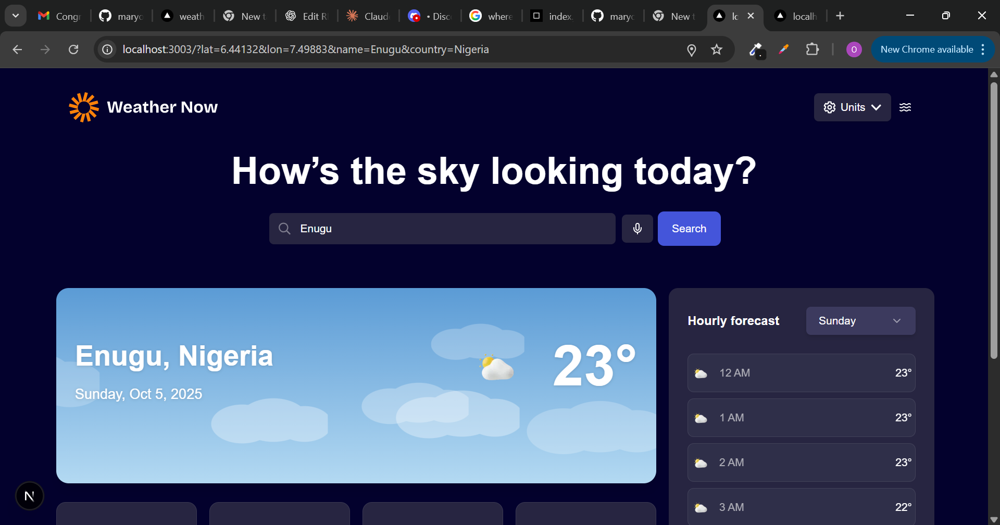

#  Weather App

This is a responsive and animated Weather App built as a solution to the [Frontend Mentor - Weather App Challenge](https://www.frontendmentor.io/challenges/weather-app-K1FhddVm49).  
It allows users to search for weather conditions in any city and view detailed forecasts with engaging animated backgrounds, real-time geolocation detection, and voice-enabled search.

##  Table of Contents

- [Overview](#overview)
  - [The Challenge](#the-challenge)
  - [Features](#features)
  - [Screenshot](#screenshot)
  - [Links](#links)
- [My Process](#my-process)
  - [Built With](#built-with)
  - [What I Learned](#what-i-learned)
  - [Continued Development](#continued-development)
  - [Useful Resources](#useful-resources)
- [Installation](#installation)
- [Author](#author)
- [Acknowledgments](#acknowledgments)

---

## Overview

### The Challenge

Users should be able to:

- Search for weather information by typing or speaking into the voice input
- View current weather including temperature, condition, and location
- Automatically detect their location using **geolocation**
- See "feels like", humidity, wind speed, and precipitation
- Browse a 7-day forecast with daily highs/lows and weather icons
- View hourly forecasts for any selected day
- Toggle between Celsius/Fahrenheit and metric/imperial units
- Switch between **light and dark themes** and also set it to auto switch to adapt to the time of the day.
- Enjoy smooth animated backgrounds that change dynamically based on weather
- Experience a mobile-optimized and accessible interface

### Features

- **Auto Geolocation** – Detects user’s current city instantly
- **Voice Search** – Search weather by speaking instead of typing
- **Animated Backgrounds** – Real-time motion effects using Framer Motion
- **Dark & Light Mode** – Theme toggling for better user comfort
- **Responsive Design** – Optimized for all device sizes
- **Unit Toggle** – Switch between Celsius ↔ Fahrenheit and km/h ↔ mph
- **Accurate Weather Data** – Powered by OpenWeather API
- **Modern UI Components** – Built with shadcn/ui for accessible and consistent design

---

### Screenshot



---

### Links

- **Solution URL:** [ https://www.frontendmentor.io/solutions/weather-app-with-nextjs-framer-motion-and-voice-search-2KUIQW7wtF

](#)

- **Live Demo:** [weather-app-check-96.vercel.app
  ](#)

---

## My Process

### Built With

- **React.js (with Hooks)**
- **Next.js (App Router)**
- **TypeScript**
- **shadcn/ui**
- **Framer Motion** – for animated backgrounds
- **OpenWeather API** – for real-time weather data
- **Geolocation API** – for automatic location detection
- **Speech Recognition API** – for voice-enabled search
- **Styled Components / CSS Modules**
- **Mobile-first responsive design**

---

### What I Learned

This project helped me strengthen my understanding of:

- Integrating **browser APIs** like Geolocation and Speech Recognition
- Managing **asynchronous weather data** and state in React
- Implementing **Framer Motion animations** for dynamic weather backgrounds
- Designing **accessible UI components** for both mobile and desktop
- Structuring a responsive weather dashboard using modern React patterns

Example snippet for animated background logic:

```tsx
const animationType = useMemo(() => getWeatherAnimation(weatherCode), [weatherCode]);


### Continued Development

In future versions, I plan to:

 Add sunrise and sunset visuals with icons and real-time indicators

 Compare multiple locations side-by-side to view different city conditions simultaneously

 Enable Progressive Web App (PWA) support for mobile installation and offline access


### Useful Resources

OpenWeather API Docs

Framer Motion Documentation

MDN – Geolocation API

Web Speech API – SpeechRecognition

Next.js Documentation

### Installation

To run this project locally:
# Clone the repository
git clone https://github.com/maryokafor28/Weather-app.git

# Navigate to the project folder
cd weather-app

# Install dependencies
npm install

# Run the development server
npm run dev
```
 Author

Your Name – Amadi Mary

Frontend Mentor – @maryokafor28


Twitter – https://x.com/OkaforVincy?t=D46RzrmSjNyJMF-pWAXwQg&s=09


